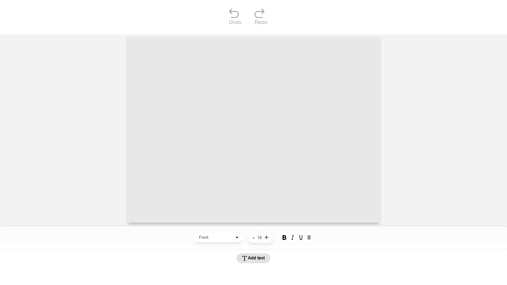
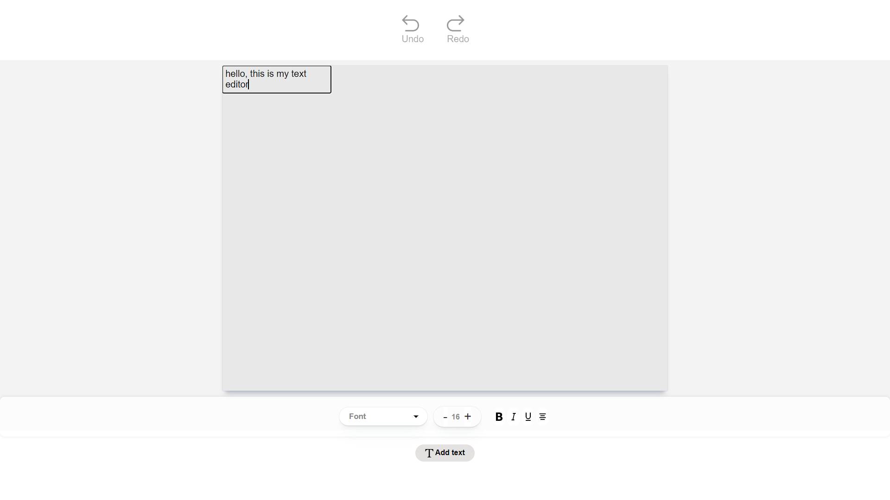
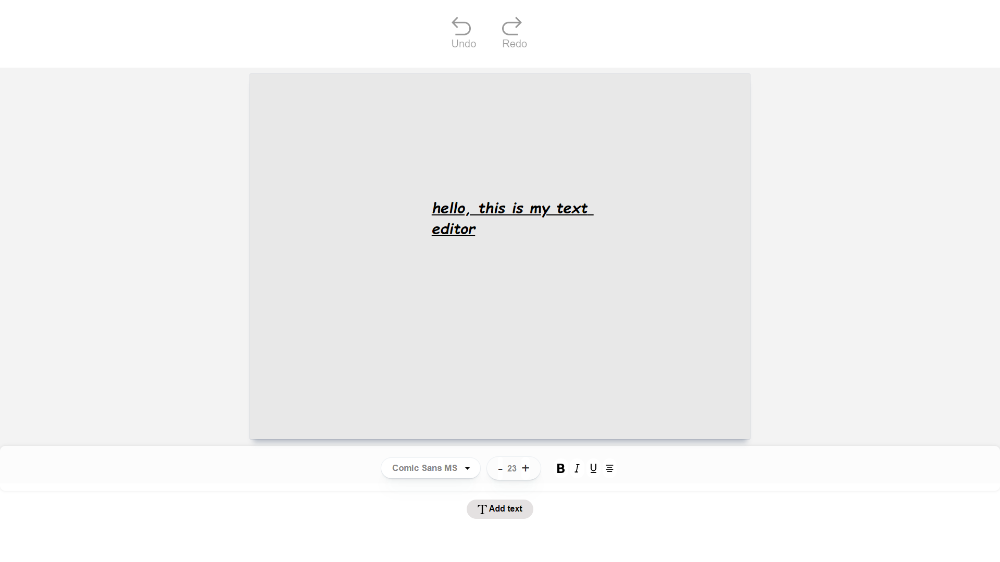

# Rich Text Editor with Drag-and-Drop

**Rich Text Editor** is an interactive web application built with **React.js** that allows users to create and edit text blocks. With features like drag-and-drop positioning, rich text formatting, and undo/redo functionality, it offers an enhanced and customizable text editing experience.

## Screenshots

### Editor Screen




## Features

- **Add Text Blocks:** Dynamically add new text blocks to the editing area.
- **Drag-and-Drop:** Easily drag and drop text blocks to reposition them within the editor.
- **Rich Text Formatting:** Apply styles like bold, italic, underline, font size, font family, and alignment.
- **Undo/Redo:** Undo or redo any action performed on the text blocks.
- **Responsive Design:** Works on both desktop and mobile devices, ensuring a smooth experience across platforms.
- **Built with React:** The entire editor is built using **React.js**, ensuring smooth state management and fast rendering.

## Installation

To run this project locally, follow these steps:

1. **Clone the repository:**
   ```bash
   git clone https://github.com/your-username/rich-text-editor.git
